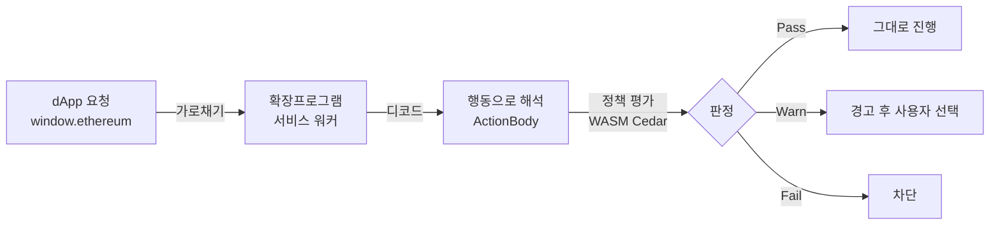

# DAMBI란?

**DAMBI(담비)** 는 지갑에서 일어나는 트랜잭션과 서명을 **사용자가 승인하기 직전에 가로채서**, 그 내용이 안전한지 정책으로 검사하고 **경고하거나 차단**해주는 브라우저 확장프로그램입니다.

dApp이 보내는 `eth_sendTransaction`, EIP-712 서명, `personal_sign` 같은 요청은 보통 16진수 calldata 덩어리라 사람이 읽기 어렵습니다. DAMBI는 이걸 **"무엇을 하려는 행동인지"** 사람이 이해할 수 있는 형태로 해석한 뒤, 미리 설치해 둔 규칙(정책)에 비춰 판정합니다.

> "이 서명, 진짜 해도 되는 거 맞아?"를 서명 버튼을 누르기 **전에** 대신 확인해 줍니다.

## 해결하는 문제

지갑 피싱·드레이너 사고의 대부분은 사용자가 **내용을 모른 채 서명**하면서 일어납니다.

* 무제한 토큰 승인(approve)으로 잔고 전체가 인출되는 경우
* 가짜 사이트가 요청한 NFT 일괄 양도 서명
* 슬리피지를 악용한 비정상 스왑
* 제재(sanctioned) 주소로의 전송

DAMBI는 이런 행동을 **서명 전에** 사람이 읽을 수 있는 말로 풀어주고, 위험하면 막아줍니다.

## 동작 방식 <수정해야함>

1. **가로채기** — dApp이 지갑에 보내는 트랜잭션/서명 요청을 확장프로그램이 가로챕니다.
2. **해석(디코드)** — 레지스트리에 등록된 어댑터로 raw calldata를 `ActionBody`(토큰 전송, 스왑, 대출, NFT 거래 등 행동 단위)로 변환합니다.
3. **평가** — 확장프로그램 안의 WASM Cedar 엔진이 설치된 정책으로 평가합니다. **판정은 네트워크 왕복 없이 기기 안에서** 끝납니다.
4. **판정** — `Pass`(통과) / `Warn`(경고) / `Fail`(차단) 중 하나를 사용자에게 보여줍니다. 자세한 의미는 [판정 이해하기](getting-started/verdicts.md)를 보세요.

## 핵심 개념

| 개념                 | 설명                                                                          |
| ------------------ | --------------------------------------------------------------------------- |
| **행동(ActionBody)** | raw 트랜잭션/서명을 해석한 의미 단위. 토큰·스왑·대출·무기한선물·NFT 등 도메인별로 구분됩니다.                   |
| **정책(Policy)**     | "어떤 행동이 안전/위험한지" 정의하는 규칙. [Cedar](https://www.cedarpolicy.com/) 문법으로 표현됩니다. |
| **판정(Verdict)**    | 정책 평가 결과. `Pass` / `Warn` / `Fail`.                                         |
| **정책 허브**          | 미리 만들어진 정책을 찾아 설치하거나, 직접 만든 정책을 공유하는 곳.                                     |
| **대시보드**           | 정책을 만들고·관리하고·시뮬레이션으로 테스트하는 관리 화면.                                           |

## 사용 대상

* **지갑 사용자** — 확장프로그램을 설치하고 정책 허브에서 정책을 받아 보호받습니다. → [5분 튜토리얼](getting-started/tutorial.md)
* **정책 작성자/배포자** — 직접 정책을 만들어 정책 허브에 공유합니다.
* **개발자/기여자** — 새 프로토콜 어댑터를 추가하거나 엔진에 기여합니다. → [아키텍처 개요](reference/architecture.md)

## 다음 단계


[install.md](getting-started/install.md)



[tutorial.md](getting-started/tutorial.md)

