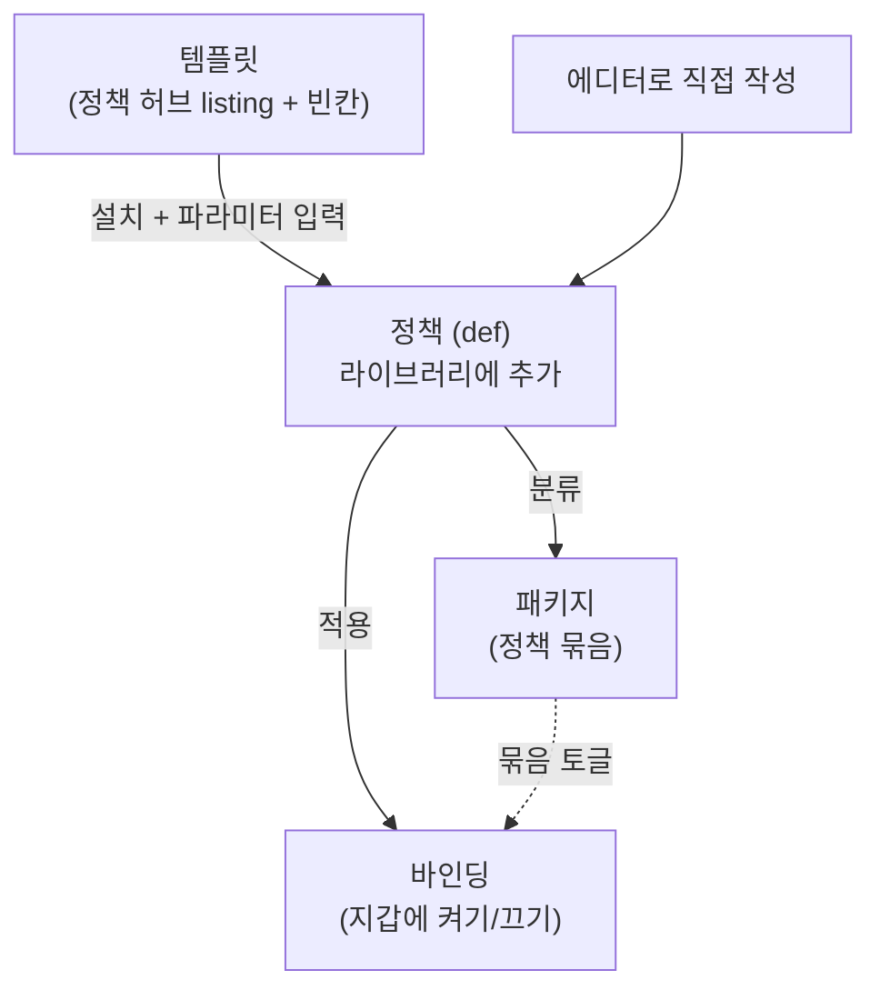

# 템플릿·정책·패키지의 관계

DAMBI에서 정책을 다루다 보면 **템플릿 / 정책 / 패키지**(그리고 세트·바인딩)라는 말이 나옵니다. 이 페이지는 이 개념들이 서로 어떻게 연결되는지 정리합니다.

## 한눈에



흐름 한 줄: **템플릿 → (설치 + 파라미터) → 정책 → 패키지로 묶음 → 바인딩으로 지갑에 적용.**

## 정책 (Policy)

가장 작은 단위입니다. **규칙 하나**(매니페스트 + Cedar)를 담은 정의이며, 내부적으로 `def::…` 형태의 id를 가집니다.

* **출처(source)** 가 셋 있습니다: `builtin`(기본 내장), `mine`(직접 작성), `market`(정책 허브에서 설치).
* 계정 **라이브러리**(account-wide)에 저장됩니다.
* **빈칸(holes/파라미터)** 과 채워진 **기본값**을 함께 가집니다. (빈칸 개념은 [에디터로 정책 만들기](editor.md)의 "값" 참고)

## 템플릿 (Template)

템플릿은 **별도의 저장 엔티티가 아닙니다.** **빈칸(파라미터)이 있는 정책/세트**를 가리키는 말이에요.

* 정책 허브의 listing이 템플릿 역할을 합니다. 설치할 때 빈칸을 채우면 내 라이브러리에 **구체적인 정책(def)** 이 생깁니다.
* 즉 템플릿은 "값만 채우면 되는 정책 틀"입니다. 같은 템플릿으로 **기준 금액만 다르게** 여러 정책을 만들 수 있습니다.
* 직접 에디터로 작성한 정책도 빈칸을 두면 같은 방식으로 재사용 가능한 틀이 됩니다.

## 패키지 (Package)

여러 정책을 **묶는 단위**입니다. 두 층위가 있습니다.

| 종류 | 위치 | 역할 |
|------|------|------|
| **라이브러리 패키지** (`pkg::…`) | 계정 전체 | 정책을 분류하는 **폴더**. 라이브러리에서 정책을 카테고리별로 정리 |
| **지갑 패키지** | 특정 지갑 | 그 지갑에서 여러 정책을 **한꺼번에 켜고/끄는 그룹** |

> 같은 정책이라도 라이브러리에서는 분류 폴더에, 지갑에서는 토글 그룹에 속할 수 있습니다.

## 세트 (Set) vs 패키지

* **세트(set)** 는 정책 허브에서 **여러 정책을 묶어 게시한 배포 단위**입니다. (정책 허브의 listing 종류: `policy`(단일) 또는 `set`(묶음))
* 세트를 **설치하면** 로컬에 **라이브러리 패키지 하나 + 포함된 개별 정책들**로 풀립니다.
* 정리하면: 세트 = "허브에 올라간 묶음", 패키지 = "내 기기에 풀린 묶음".

## 바인딩 (Binding): 지갑에 적용

정책을 **특정 지갑에 적용**하는 연결입니다. 채운 파라미터, on/off 상태, 어느 패키지 소속인지를 함께 가집니다.

* 같은 정책을 **지갑마다 다른 파라미터**로 바인딩할 수 있습니다. (예: 지갑 A는 100 USD, 지갑 B는 1000 USD 기준)
* 정책 켜고 끄기는 사실상 이 바인딩을 토글하는 것입니다. ([정책 켜기·끄기와 지갑별 설정](../user-guide/managing-policies.md))

## 전체 구조

```
계정 (account)
├─ 라이브러리 (계정 공통)
│  ├─ 정책(def)      ← 템플릿 설치 또는 에디터로 직접 작성해서 생김
│  └─ 패키지(pkg)    ← 정책 분류 폴더
└─ 지갑별 (wallet)
   ├─ 바인딩         ← 이 지갑에 정책 적용 (파라미터 + on/off)
   └─ 패키지         ← 이 지갑에서 묶음 토글
```

## 정리 표

| 개념 | 한 줄 정의 | 범위 |
|------|-----------|------|
| **정책(def)** | 규칙 하나 (매니페스트 + Cedar) | 계정 라이브러리 |
| **템플릿** | 빈칸이 있는 정책/세트 (설치 시 채워 정책 생성) | 정책 허브 |
| **세트(set)** | 허브에 올라간 정책 묶음 (배포 단위) | 정책 허브 |
| **패키지(pkg)** | 정책을 분류/그룹화하는 묶음 | 라이브러리(폴더) · 지갑(토글 그룹) |
| **바인딩** | 정책을 지갑에 적용한 인스턴스 (파라미터 + on/off) | 지갑별 |

## 다음 단계

* 직접 만들기 → [에디터로 정책 만들기](editor.md)
* 묶음 켜고 끄기 → [정책 켜기·끄기와 지갑별 설정](../user-guide/managing-policies.md)
* 허브에 올리기 → [정책 허브에 배포하기](publishing.md)
