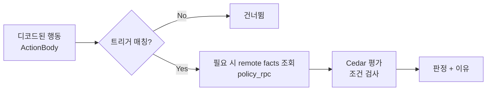

# 정책이란? (Cedar 개념)

**정책(Policy)** 은 "어떤 지갑 행동이 위험한지"를 정의하는 규칙입니다. DAMBI는 [Cedar](https://www.cedarpolicy.com/) 언어로 정책을 표현하고, 디코드된 행동([ActionBody](../reference/actionbody-cedar.md))에 비춰 평가합니다.

## 정책의 효과

DAMBI에서 정책의 효과는 **`forbid`(차단)** 입니다. **강도(severity)**&#xB85C; 얼마나 강하게 차단할 것인지를 정합니다.([판정 이해하기](../getting-started/verdicts.md))

| 강도     | 결과 판정   | 의미                 |
| ------ | ------- | ------------------ |
| `deny` | 🔴 Fail | 즉시 차단 (사용자 우회 불가)  |
| `warn` | 🟡 Warn | 경고 후 사용자가 진행/취소 선택 |
| `info` | ℹ️ 정보   | 차단·경고 없이 알림만       |

> 즉 정책 작성은 "이런 조건이면 **금지**한다, 그 강도는 X다"를 쓰는 일입니다.

## 정책이 행동에 매칭되는 과정

1. **트리거(trigger) 먼저** — 매니페스트의 선언적 선택자로 "이 정책이 이 행동에 적용되는지" 먼저 거릅니다. 안 맞으면 건너뜁니다.
2. **enrichment(선택)** — 트리거가 맞고 외부 사실이 필요하면 `policy_rpc` 호출을 실행해 `context.custom.*`에 채웁니다 (예: USD 가치).
3. **Cedar 평가** — 행동의 컨텍스트(정적 필드 + 외부 사실)로 조건을 검사합니다.

### 트리거가 보는 필드

얕고 안정적인 필드로 매칭합니다:

* `action.domain` — `token`, `amm`, `perp` …
* `action.tag` — `swap`, `erc20_approve`, `place_order` …
* `action.venue` — `uniswap_v3`, `aave_v3`, `hyperliquid` …
* `tx.chain_id` — `eip155:1` 등
* `tx.from`, `tx.to`

제약: `eq`(같음) / `ne`(다름) / `in`(집합 포함) / `nin`(미포함). `where`의 조건은 모두 AND로 결합되며, 비어 있으면 항상 매칭됩니다.

### Cedar가 평가하는 컨텍스트

* **정적 필드** — calldata/서명에서 디코드된 값: `context.amount`, `context.recipient`, `context.spender`, `context.leverage` 등
* **외부 사실(remote facts)** — `policy_rpc`로 채운 값: 오라클 가격, 토큰/거래소 평판, 제재 여부 등 (`context.custom.*`)
* **시간 필드** — 제출 시각, 마감(deadline), 유효 기간
* **Cedar 기본형** — `String`, `Long`, `Decimal`, `Bool`, `Set<String>`

## 정책 번들 = 매니페스트 + Cedar

DAMBI의 정책 하나는 **매니페스트(manifest.json)** 와 **Cedar 텍스트(policy.cedar)** 의 짝입니다.

| 파일              | 역할                     |
| --------------- | ---------------------- |
| `manifest.json` | 언제 적용할지와 어떤 외부 사실을 채울지 |
| `policy.cedar`  | 실제 금지 규칙·조건·강도·이유      |

자세한 구조는 [ActionBody & Cedar](../reference/actionbody-cedar.md)를 보세요.

## 다음 단계

* 폼으로 쉽게 만들기 → [에디터로 정책 만들기](editor.md)
* 어떤 행동을 막을 수 있나 → [액션 종류](action-types.md)
* 실제 예제 → [유스케이스별 정책 예제](examples.md)
