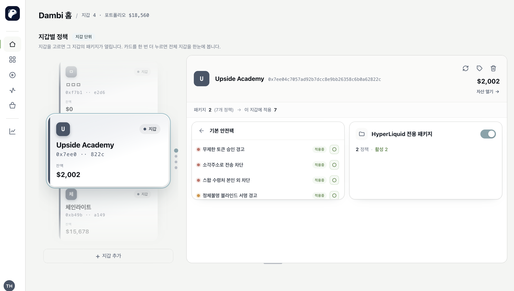

# 대시보드 구조

대시보드는 정책을 만들고·관리하고·테스트하며, 지갑 상태와 판정 기록을 한눈에 보는 관리 화면입니다. 팝업 → **대시보드 열기** 로 진입할 수 있습니다.

## 좌측 메뉴 (NavRail)

<table><thead><tr><th width="179.50390625">메뉴</th><th width="383.73828125">하는 일</th><th>자세히</th></tr></thead><tbody><tr><td><strong>홈 (Home)</strong></td><td>지갑별 정책·패키지 적용 현황을 한눈에 보는 다이얼</td><td>-</td></tr><tr><td><strong>정책 관리 (Editor)</strong></td><td>정책 목록·생성·편집 (문장형/Cedar 에디터)</td><td><a href="../authoring/editor.md">에디터로 정책 만들기</a></td></tr><tr><td><strong>정책 허브 (Market)</strong></td><td>정책·패키지 탐색 및 설치</td><td><a href="marketplace.md">정책 허브에서 정책 찾기</a></td></tr><tr><td><strong>시뮬레이션 (Simulation)</strong></td><td>정책을 실제 calldata로 미리 테스트</td><td><a href="simulation.md">시뮬레이션</a></td></tr><tr><td><strong>자산 (Assets)</strong></td><td>지갑 포트폴리오 모니터링 (보유 토큰·승인·포지션)</td><td>-</td></tr><tr><td><strong>히스토리 (History)</strong></td><td>가로챈 트랜잭션/서명의 판정 기록</td><td><a href="history.md">히스토리</a></td></tr><tr><td><strong>프로필 (Profile)</strong></td><td>계정·설정·게시한 정책 관리</td><td><a href="dashboard.md#프로필-설정">아래 참고</a></td></tr></tbody></table>

## 홈 (Home)

지갑마다 어떤 패키지/정책이 적용돼 있는지 다이얼 형태로 보여줍니다. 보호 상태(정책 적용 상태)를 빠르게 점검하는 기본 페이지

<figure><figcaption></figcaption></figure>

## 자산 (Assets)

연결한 지갑의 포트폴리오 모니터링 페이지

* 자산 상태, 보유 토큰, 승인, DeFi 포지션(hyperliquid), 대기 트랜잭션(pending)및 각종 지갑 상태 추적

<figure><figcaption></figcaption></figure>

## 프로필 / 설정

**계정**

* 이메일 / user\_id 표시, 로그아웃

**게시한 정책 (Published)**

* 내가 정책 허브에 올린 정책/패키지 목록

**설정 (Settings)**

* **언어** | 한국어 / 영어
* **OpenAI API 키** | LLM 정책 작성용

**초기화 스위치** (확인 후 실행)

* 지갑 초기화 / 정책 초기화 (기본 내장 정책은 삭제 불가)

## 다음 단계

* 정책 받기 → [정책 허브에서 정책 찾기·설치하기](marketplace.md)
* 정책 만들기 → [에디터로 정책 만들기](../authoring/editor.md)
